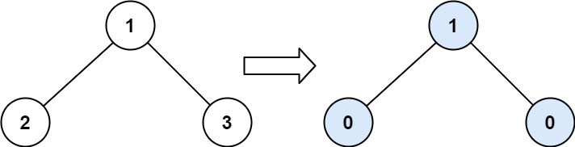

# 563. 二叉树的坡度

给定一个二叉树，计算 整个树 的坡度 。

一个树的 ```节点的坡度``` 定义即为，该节点左子树的节点之和和右子树节点之和的 差的绝对值 。如果没有左子树的话，左子树的节点之和为 0 ；没有右子树的话也是一样。空结点的坡度是 0 。整个树 的坡度就是其所有节点的坡度之和。

示例 1：


```text
输入：root = [1,2,3]
输出：1
```

```text
解释：
节点 2 的坡度：|0-0| = 0（没有子节点）
节点 3 的坡度：|0-0| = 0（没有子节点）
节点 1 的坡度：|2-3| = 1（左子树就是左子节点，所以和是 2 ；右子树就是右子节点，所以和是 3 ）
坡度总和：0 + 0 + 1 = 1
```

示例 2：


```text
输入：root = [4,2,9,3,5,null,7]
输出：15
```

```test
解释：
节点 3 的坡度：|0-0| = 0（没有子节点）
节点 5 的坡度：|0-0| = 0（没有子节点）
节点 7 的坡度：|0-0| = 0（没有子节点）
节点 2 的坡度：|3-5| = 2（左子树就是左子节点，所以和是 3 ；右子树就是右子节点，所以和是 5 ）
节点 9 的坡度：|0-7| = 7（没有左子树，所以和是 0 ；右子树正好是右子节点，所以和是 7 ）
节点 4 的坡度：|(3+5+2)-(9+7)| = |10-16| = 6（左子树值为 3、5 和 2 ，和是 10 ；右子树值为 9 和 7 ，和是 16 ）
坡度总和：0 + 0 + 0 + 2 + 7 + 6 = 15
```

示例 3：


```text
输入：root = [21,7,14,1,1,2,2,3,3]
输出：9
```

来源：力扣（LeetCode）

链接：https://leetcode-cn.com/problems/binary-tree-tilt

著作权归领扣网络所有。商业转载请联系官方授权，非商业转载请注明出处。

## 解法

### 题目分析

- 通过示例分析出每个节点的坡度等于左子树之和减去右子树之和，然后取它们的绝对值

### 解题思路

- 通过上面的示例分析得出规律后，我们可采用递归方式进行深度遍历，从最后一个节点开始累计坡度，同时返回当前节点所有子节点的数字之和，为了方面之后的节点计算坡度值

- 解题代码

```js
/**
 * Definition for a binary tree node.
 * function TreeNode(val, left, right) {
 *     this.val = (val===undefined ? 0 : val)
 *     this.left = (left===undefined ? null : left)
 *     this.right = (right===undefined ? null : right)
 * }
 */
/**
 * @param {TreeNode} root
 * @return {number}
 */
var findTilt = function(root) {
    let result = 0
    function depth(root) {
      if(!root) {
          return;
      }
      if(root.left === null) {
          result+=0;
      } else {
         root.left.val = depth(root.left);
      }
       if(root.right === null) {
          result+=0;
      } else {
          root.right.val = depth(root.right);
      }
      result +=Math.abs((root.left?.val || 0) - (root.right?.val || 0));
      return (root.left?.val || 0) + (root.right?.val || 0) + root.val;
    }
    depth(root);
    return result;
};
```
